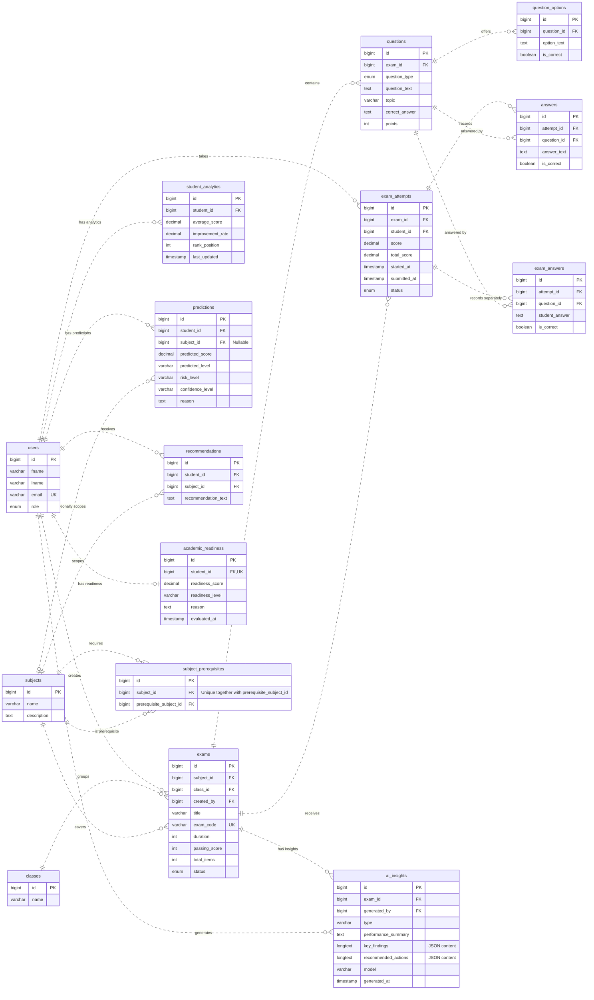

# AI-Q Entity Relationship Diagram

Verified against the live `scoreforge_ai` database on 2026-09-20. This diagram covers 15 application tables and their 21 foreign-key relationships. Framework infrastructure tables (sessions, cache, queues, and migration tracking) are outside this view. Selected business fields are shown; routine timestamps and authentication fields are omitted.

## Reading the diagram

- **PK**: primary key; **FK**: foreign key; **UK**: unique key.
- `||`: exactly one; `o|` or `|o`: zero or one; `o{`: zero or many.
- Dotted relationships are non-identifying: each child has its own primary key rather than using its parent foreign key as part of that primary key.
- Teachers, students, and administrators share `users`; `role` distinguishes them. Role restrictions are enforced by application logic, not these foreign keys.

## Schema notes

- Both `answers` and `exam_answers` exist and reference attempts and questions. They are shown separately, not merged.
- `student_analytics.student_id` is not unique in the database, so the physical schema permits multiple rows per student even though the User model declares a one-to-one relationship.
- `academic_readiness.student_id` is unique, permitting at most one readiness record per student.
- `predictions.subject_id` is nullable, so a prediction can have no subject.
- `subject_prerequisites` has a unique constraint on the pair `(subject_id, prerequisite_subject_id)`, not on either column alone.
- There is no direct student-to-class enrollment foreign key in this schema. Classes connect to students through exams and attempts.
- The live database was used as the source of truth because the migrations contain two different `predictions` creation definitions and an empty user-name alteration migration.

